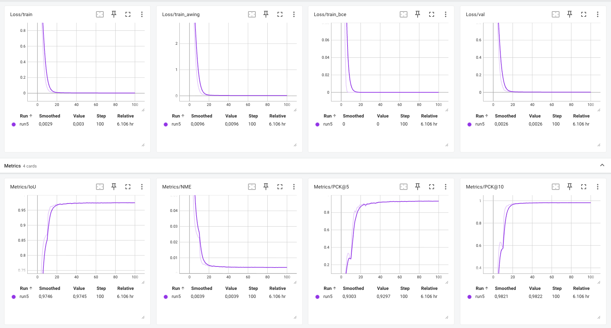
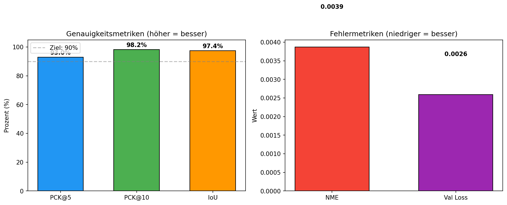

 
 

# LDED

Lightweight Document Edge Detection — real-time corner detection in the browser.

 

<!-- Version Chips -->

 
 

<!-- Quick Status -->

 
 

<!-- Tech Tags -->

 
 

<!-- Positioning Tags -->

 
 

<!-- Demo Link -->

---

## Why LDED

Mobile document scanning requires fast and accurate detection of document boundaries. Classical computer vision approaches are fragile under varying lighting conditions, cluttered backgrounds, and perspective distortion. At the same time, while both \(iOS\) and \(Android\) already ship with operating-system-level computer vision and machine learning capabilities for tasks such as edge or document detection, these native capabilities are generally not accessible from within the browser. Web applications therefore cannot rely on the optimized on-device models that native apps can use.

This creates a clear gap: existing deep learning models for document boundary detection are typically too large or too computationally expensive to run in real time in a browser environment, especially on end-user mobile devices. In practice, there are currently no broadly available browser-first models that combine the necessary accuracy, speed, and device-level efficiency for this task.

LDED addresses this gap by providing a neural network compact enough to run entirely client-side via WebAssembly. This enables real-time document boundary detection directly in the browser, without server roundtrips, without exposing sensitive images to external infrastructure, and without the operational cost of backend processing.

## Highlights

- Real-time document corner detection (< 100 ms) directly in the browser
- Privacy-preserving — all inference happens on-device, no data leaves the client
- Trained on diverse datasets (DocCorner, MIDV-500/2020, SmartDoc-2015) with heavy augmentation
- 3-phase training curriculum: Backbone Freeze → Fine-Tuning → Quantization-Aware Training
- Targets > 92 % corner precision (PCK@5) with < 5 MB model size

## Use Cases

- Browser-based document scanners
- Mobile receipt and invoice capture
- ID card and passport boundary detection
- Drop-in integration into existing web applications

## Results

| Training Curves (TensorBoard) | Evaluation Metrics |
|:-----------------------------:|:------------------:|
|  |  |

 

### Benchmark

| Metric | LDED (ours) | Target | SmartDoc Baseline |
|--------|:-----------:|:------:|:-----------------:|
| PCK@5 ↑ | 93.0 % | > 92 % | — |
| PCK@10 ↑ | 98.2 % | > 97 % | — |
| IoU ↑ | 97.4 % | > 90 % | — |
| NME ↓ | 0.39 % | < 3.0 % | — |
| Val Loss ↓ | 0.0026 | — | — |

> *↑ = higher is better, ↓ = lower is better. Results on validation split. Baseline columns to be filled after final evaluation.*

### Model Card

| Property | Value |
|----------|-------|
| Architecture | MobileNetV3-Small + FPN-Lite + Heatmap Head |
| Input size | 512 × 512 px |
| Parameters | ~2.5 M |
| Model size (FP32) | ~10 MB |
| Model size (INT8) | < 5 MB |
| Output | 4 corner points (x, y) + confidence |
| Framework | PyTorch 2.x → ONNX |

### Training Configuration

| Setting | Value |
|---------|-------|
| Optimizer | AdamW |
| Learning rate | 1e-3 (phase 1), 1e-4 (phase 2) |
| Scheduler | CosineAnnealingLR |
| Batch size | 16 |
| Epochs | 50 (phase 1) + 30 (phase 2) |
| Loss | Adaptive Wing + BCE + Coordinate |
| AMP | Enabled (CUDA) |
| Augmentation | Perspective, Brightness/Contrast, MotionBlur, JPEG, GaussNoise |

### Datasets

| Dataset | Raw Samples | × Augmentation | Effective Samples | Split |
|---------|------------:|:--------------:|------------------:|-------|
| DocCorner (HuggingFace) | ~4,000 | ×3 | ~12,000 | train / val / test |
| MIDV-500/2020 (synthesized) | ~3,000 | ×3 | ~9,000 | train / val |
| Mendeley Corner | ~1,100 | ×3 | ~3,300 | train / val |
| **Total** | **~8,100** | | **~24,300** | — |

### Inference

| Runtime | Device | Latency |
|---------|--------|---------|
| ONNX Runtime Web (WebGPU) | Desktop browser | ~60 ms |
| ONNX Runtime Web (WASM) | Desktop browser | ~500 ms |
| ONNX Runtime Web (WebGPU) | iPhone (mobile) | ~237 ms |
| ONNX Runtime Web (WASM) | iPhone (mobile) | ~500 ms |

## Contents

- [Architecture](lded/architecture.md)
- [Training Guide](lded/training_guide.md)
- [Technical README](lded/README.md)

---

**CAS project work** by Simon Fuchs & Raphael Fuchs, 2026
